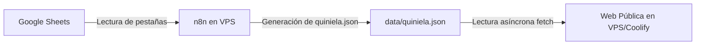

# Contrato del Archivo JSON de la Quiniela Mundialista 2026

Este documento define el formato técnico del archivo de intercambio de datos `data/quiniela.json`. Este archivo sirve como el contrato de integración definitivo entre la fuente de datos en Google Sheets, el flujo de integración de n8n, y el frontend de la aplicación web pública.

---

## 🏗️ Flujo de Arquitectura de Datos



### Reglas Generales de Operación
1. **Fuente Única de Verdad (SSOT)**: Google Sheets es la fuente única de verdad. Todos los datos de partidos, participantes y pronósticos deben editarse y gestionarse desde ahí.
2. **Generador n8n**: Un webhook o proceso cron en n8n leerá las pestañas (Partidos, Participantes y Pronosticos) de Google Sheets y creará/sobreescribirá el archivo `data/quiniela.json` en el servidor VPS/Coolify.
3. **Lectura Web**: La web pública es de solo lectura y consume de forma directa y asíncrona `data/quiniela.json`.
4. **Independencia Local**: La aplicación web se ejecuta online en el VPS. No requiere que ninguna computadora local o USB esté conectada o encendida para su funcionamiento normal.
5. **Almacenamiento de Avatares**: Los avatares de imagen de los participantes viven físicamente en la carpeta `/avatars/` dentro del despliegue del proyecto web. La memoria USB solo sirve como respaldo secundario manual.

---

## 📄 Estructura General del JSON

La raíz del archivo JSON contiene cinco secciones principales:

```json
{
  "metadata": {},
  "partidos": [],
  "participantes": [],
  "pronosticos": [],
  "validaciones": []
}
```

---

## 🗂️ Detalle de Secciones y Campos

### 1. `metadata`
Contiene la información de auditoría, totales generales del torneo y estado de sincronización.

| Campo | Tipo | Descripción / Ejemplo |
| :--- | :--- | :--- |
| `ultimaActualizacion` | String | Fecha y hora formateada de última ejecución (ej: `"01 Jun 2026, 11:00"`). |
| `totalParticipantes` | Entero | Número total de participantes registrados (ej: `12`). |
| `participantesActivos` | Entero | Cantidad de participantes con estado activo (ej: `12`). |
| `partidosJugados` | Entero | Total de partidos terminados a la fecha (ej: `18`). |
| `partidosPendientes` | Entero | Total de partidos que no han comenzado (ej: `46`). |
| `totalPartidos` | Entero | Suma de jugados + pendientes (ej: `64`). |
| `fuente` | String | Indicador del origen (ej: `"Google Sheets via n8n"`). |
| `modo` | String | Identificador del modo (ej: `"Producción"`). |

---

### 2. `partidos`
Representa el listado completo del calendario del torneo mundialista.

| Campo | Tipo | Reglas y Valores Aceptados |
| :--- | :--- | :--- |
| `PartidoID` | String | Identificador único del partido (ej: `"P01"`, `"P02"`). |
| `Fecha` | String | Día y mes del encuentro (ej: `"15 junio"`). |
| `Hora` | String | Horario local del partido (ej: `"18:00 hrs"`). |
| `Grupo` | String | Grupo al que pertenece el partido (ej: `"Grupo A"`). |
| `Local` | String | Nombre del equipo local (ej: `"México"`). |
| `Visitante` | String | Nombre del equipo visitante (ej: `"Sudáfrica"`). |
| `ResultadoReal` | String | Resultado deportivo real: `"L"` (Local), `"E"` (Empate), `"V"` (Visitante) o `""` (Vacío si no se ha jugado). |
| `Estado` | String | Estado del encuentro: `"Jugado"` o `"Pendiente"`. |
| `ResultadoTexto` | String | Descripción legible o marcador del partido (ej: `"1 - 1"`, `"Empate"`, o el nombre del ganador). |
| `Revision` | String | Estatus de validación interna: `"OK"`, `"FALTA"`, o `"ERROR"`. |

---

### 3. `participantes`
Listado de los concursantes de la quiniela de la oficina.

| Campo | Tipo | Reglas y Valores Aceptados |
| :--- | :--- | :--- |
| `ParticipanteID` | String | Identificador único del participante (ej: `"PART01"`). |
| `Nombre` | String | Nombre completo del compañero (ej: `"Juan Pérez"`). |
| `Alias` | String | Apodo o alias público mostrado en la web (ej: `"El Profe"`). |
| `Avatar` | String | Nombre de archivo del avatar en `/avatars/` (ej: `"elprofe.png"`). **No debe contener ruta absoluta ni prefijos como `/avatars/`**. Si se deja vacío, la web cargará un fallback visual por defecto. |
| `Color` | String | Código hexadecimal para la pista de carrera e indicadores (ej: `"#ff2d78"`). |
| `Activo` | String | `"Sí"` o `"No"`. **La web pública solo debe renderizar participantes activos (`"Sí"`)**. |
| `Puntos` | Entero | Puntos totales acumulados en la quiniela (ej: `42`). |
| `Aciertos` | Entero | Cantidad de pronósticos acertados con éxito (ej: `14`). |
| `PartidosJugados` | Entero | Cantidad de partidos para los que el participante envió pronóstico y ya finalizaron (ej: `18`). |
| `Porcentaje` | Decimal | Porcentaje de acierto o efectividad calculado (ej: `77.8`). |
| `Posicion` | Entero | Posición en la tabla de clasificación general (ej: `1`). |
| `Revision` | String | Estado de control y auditoría: `"OK"`, `"FALTA"`, o `"ERROR"`. |

---

### 4. `pronosticos`
Historial de predicciones realizadas por los participantes. Ayuda a auditar la suma de puntos y a calcular en tiempo real el comportamiento electoral de la oficina.

| Campo | Tipo | Reglas y Valores Aceptados |
| :--- | :--- | :--- |
| `ParticipanteID` | String | Identificador del participante que pronostica. |
| `Nombre` | String | Nombre o alias del participante. |
| `PartidoID` | String | Identificador del partido pronosticado. |
| `Partido` | String | Texto descriptivo del encuentro para diagnósticos rápidos (ej: `"México vs Sudáfrica"`). |
| `Pronostico` | String | Predicción del participante: `"L"`, `"E"`, `"V"` o `""` (Vacío si no pronosticó). |
| `ResultadoReal` | String | Copia auxiliar del resultado final real: `"L"`, `"E"`, `"V"` o `""`. Ayuda al diagnóstico y visualización en Sheets. |
| `Punto` | Entero | Puntos obtenidos por esta predicción: `1` (acierto) o `0` (fallo o pendiente). |
| `Validacion` | String | Estatus de cálculo de n8n: `"OK"`, `"FALTA"`, o `"ERROR"`. |

---

### 5. `validaciones`
Colección de advertencias o fallos detectados por el parser de n8n antes de compilar el archivo final. Esto ayuda a detectar de manera rápida inconsistencias en las capturas hechas por los usuarios en el Google Sheets.

*   Si no se detectan problemas, la lista debe ser vacía: `[]`.
*   La existencia de registros en este bloque **no debe romper la carga ni el renderizado de la web**; el frontend puede ignorarla o guardarla para futuras vistas de administración.

#### Esquema de un error/advertencia en `validaciones`:
```json
{
  "tipo": "warning",
  "origen": "Participantes",
  "mensaje": "Participante activo sin avatar asignado",
  "detalle": "ParticipanteID 3 - Cyn"
}
```

---

## 📋 Ejemplo Completo del JSON bajo Contrato

```json
{
  "metadata": {
    "ultimaActualizacion": "01 Jun 2026, 11:00",
    "totalParticipantes": 12,
    "participantesActivos": 12,
    "partidosJugados": 18,
    "partidosPendientes": 46,
    "totalPartidos": 64,
    "fuente": "Google Sheets via n8n",
    "modo": "Producción"
  },
  "partidos": [
    {
      "PartidoID": "P1",
      "Fecha": "15 junio",
      "Hora": "18:00 hrs",
      "Grupo": "Grupo A",
      "Local": "México",
      "Visitante": "Sudáfrica",
      "ResultadoReal": "",
      "Estado": "Pendiente",
      "ResultadoTexto": "",
      "Revision": "No"
    },
    {
      "PartidoID": "P2",
      "Fecha": "16 junio",
      "Hora": "15:00 hrs",
      "Grupo": "Grupo A",
      "Local": "Francia",
      "Visitante": "Marruecos",
      "ResultadoReal": "E",
      "Estado": "Jugado",
      "ResultadoTexto": "1 - 1",
      "Revision": "OK"
    }
  ],
  "participantes": [
    {
      "ParticipanteID": "PART01",
      "Nombre": "Juan Pérez",
      "Alias": "El Profe",
      "Avatar": "elprofe.png",
      "Color": "#ff2d78",
      "Activo": "Sí",
      "Puntos": 42,
      "Aciertos": 14,
      "PartidosJugados": 18,
      "Porcentaje": 77.8,
      "Posicion": 1,
      "Revision": "OK"
    }
  ],
  "pronosticos": [
    {
      "ParticipanteID": "PART01",
      "Nombre": "Juan Pérez",
      "PartidoID": "P1",
      "Partido": "México vs Sudáfrica",
      "Pronostico": "L",
      "ResultadoReal": "",
      "Punto": 0,
      "Validacion": "OK"
    },
    {
      "ParticipanteID": "PART01",
      "Nombre": "Juan Pérez",
      "PartidoID": "P2",
      "Partido": "Francia vs Marruecos",
      "Pronostico": "E",
      "ResultadoReal": "E",
      "Punto": 1,
      "Validacion": "OK"
    }
  ],
  "validaciones": [
    {
      "tipo": "warning",
      "origen": "Participantes",
      "mensaje": "Participante activo sin avatar asignado",
      "detalle": "ParticipanteID 3 - Cyn"
    }
  ]
}
```
